# FRED Dashboard Data Flow Documentation

## Overview

This document explains the complete data flow cycle in the FRED Economic Indicators Dashboard, from data fetching to rendering charts on the screen.

---

## Architecture Diagram

```mermaid
flowchart TD
    subgraph User ["👤 User Interaction"]
        Browser[User opens dashboard in browser]
        Click[User clicks sidebar menu item]
    end
    
    subgraph React ["⚛️ React Component Layer"]
        PageMount[page.tsx mounts]
        StateInit[Initialize useState hooks]
        SidebarRender[Sidebar.tsx renders]
        SectionChange[activeSection state changes]
    end
    
    subgraph Effects ["🔄 React useEffect Hooks"]
        InitEffect[Initial load useEffect]
        SectionEffect[Section-specific useEffect]
        CheckSection{Check activeSection}
    end
    
    subgraph API ["🌐 API Layer - fredApi.ts"]
        GetSeries[getFredSeries function called]
        CheckKey{API Key valid?}
        FetchFRED[Fetch from FRED API]
        FallbackSample[Use sample data]
        TransformData[Transform & filter data]
    end
    
    subgraph FRED ["🏦 Federal Reserve"]
        FREDServer[FRED API Server]
        RealData[(Real Economic Data)]
    end
    
    subgraph Transform ["🔄 Data Transformation"]
        ParseDates[Parse date strings]
        FormatDates[Format as 'Jan', 'Feb', etc]
        ParseValues[Parse value strings to floats]
        GroupData[Group/aggregate if needed]
    end
    
    subgraph State ["📦 React State Update"]
        SetState[setState functions called]
        StateUpdate[State updated with new data]
        ReRender[Component re-renders]
    end
    
    subgraph Recharts ["📊 Recharts Library"]
        ChartProps[Charts receive data as props]
        AxisCalc[Calculate axis domains]
        PlotPoints[Plot data points]
        RenderSVG[Render SVG elements]
    end
    
    subgraph Display ["🖥️ Browser Display"]
        DOM[Update DOM]
        ShowChart[Interactive chart displayed]
    end
    
    Browser --> PageMount
    PageMount --> StateInit
    StateInit --> InitEffect
    InitEffect --> GetSeries
    
    SidebarRender --> Click
    Click --> SectionChange
    SectionChange --> SectionEffect
    SectionEffect --> CheckSection
    
    CheckSection -->|Section matches| GetSeries
    CheckSection -->|Section doesn't match| SectionEffect
    
    GetSeries --> CheckKey
    CheckKey -->|Valid key| FetchFRED
    CheckKey -->|No/invalid key| FallbackSample
    
    FetchFRED --> FREDServer
    FREDServer --> RealData
    RealData --> TransformData
    FallbackSample --> TransformData
    
    TransformData --> ParseDates
    ParseDates --> FormatDates
    FormatDates --> ParseValues
    ParseValues --> GroupData
    GroupData --> SetState
    
    SetState --> StateUpdate
    StateUpdate --> ReRender
    ReRender --> ChartProps
    
    ChartProps --> AxisCalc
    AxisCalc --> PlotPoints
    PlotPoints --> RenderSVG
    RenderSVG --> DOM
    DOM --> ShowChart
```



---

## Detailed Flow Steps

### Phase 1: Application Initialization

#### Step 1.1: Page Component Mounts
**File:** `app/page.tsx`
**Lines:** 31-78

```typescript
export default function Home() {
  const [activeSection, setActiveSection] = useState('key-indicators');
  const [cpiData, setCpiData] = useState<ChartData[]>([]);
  const [loading, setLoading] = useState(true);
  // ... more state declarations
```

**What happens:**
- React renders the `Home` component
- All `useState` hooks initialize with empty arrays `[]`
- `activeSection` defaults to `'key-indicators'`
- `loading` state set to `true`

---

#### Step 1.2: Initial Data Load
**File:** `app/page.tsx`
**Lines:** 81-178

```typescript
useEffect(() => {
  async function loadData() {
    setLoading(true);
    try {
      // Calculate date ranges
      const oneYearAgo = new Date();
      oneYearAgo.setFullYear(oneYearAgo.getFullYear() - 1);
      
      // Fetch multiple series in parallel
      const [cpi, unemployment, gdp, sp500] = await Promise.all([
        getFredSeries('CPIAUCSL', oneYearAgoStr),
        getFredSeries('UNRATE', oneYearAgoStr),
        // ...
      ]);
      
      // Transform and set state
      setCpiData(transformedData);
    }
  }
  loadData();
}, []); // Empty dependency array = runs once on mount
```

**What happens:**
1. useEffect runs immediately after component mounts
2. Date calculations determine data range (e.g., last 1 year)
3. `Promise.all` fetches multiple series simultaneously
4. Each series goes through the API layer
5. Transformed data updates state via `setState`
6. Component re-renders with new data

---

### Phase 2: API Data Fetching

#### Step 2.1: API Function Call
**File:** `app/lib/fredApi.ts`
**Lines:** 16-52

```typescript
export async function getFredSeries(
  seriesId: string, 
  startDate?: string
): Promise<FredSeriesData[]> {
  // Check 1: Is API key configured?
  if (!API_KEY || API_KEY === 'your_fred_api_key_here') {
    console.warn('FRED API key not configured. Using sample data.');
    return getSampleData(seriesId);
  }
```

**What happens:**
- Function receives series ID (e.g., `'CPIAUCSL'`) and optional start date
- Checks if valid API key exists in environment variables
- If no key → returns sample data immediately
- If key exists → proceeds to API call

---

#### Step 2.2: Real API Request
**File:** `app/lib/fredApi.ts`
**Lines:** 22-47

```typescript
try {
  const params = new URLSearchParams({
    series_id: seriesId,
    api_key: API_KEY,
    file_type: 'json',
  });
  
  if (startDate) {
    params.append('observation_start', startDate);
  }
  
  const response = await fetch(
    `${FRED_API_BASE}/series/observations?${params}`
  );
  
  if (!response.ok) {
    return getSampleData(seriesId); // Fallback on error
  }
  
  const data = await response.json();
  
  return data.observations
    .filter((obs) => obs.value !== '.') // Remove missing values
    .map((obs) => ({
      date: obs.date,
      value: obs.value,
    }));
}
```

**What happens:**
1. Build URL with query parameters
2. Make HTTP GET request to FRED API
3. Wait for response
4. If error → fallback to sample data
5. Parse JSON response
6. Filter out missing values (marked as `'.'`)
7. Map to simplified data structure
8. Return array of `{date, value}` objects

---

#### Step 2.3: Sample Data Fallback
**File:** `app/lib/fredApi.ts`
**Lines:** 54-587

```typescript
function getSampleData(seriesId: string): FredSeriesData[] {
  switch (seriesId) {
    case 'CPIAUCSL':
      return [
        { date: '2024-01-01', value: '310.500' },
        { date: '2025-01-01', value: '320.750' },
        // ...
      ];
    case 'UNRATE':
      return [/* monthly unemployment data */];
    // ... more cases
    default:
      return [];
  }
}
```

**What happens:**
- Switch statement matches series ID
- Returns hardcoded sample data array
- Used when: no API key, API error, or API unavailable
- Ensures dashboard always displays data

---

### Phase 3: Data Transformation

#### Step 3.1: Date Formatting
**File:** `app/page.tsx`
**Example lines:** 133-137

```typescript
setUnemploymentData(
  unemployment.map((d) => ({
    date: new Date(d.date).toLocaleDateString('en-US', { 
      month: 'short' 
    }),
    value: parseFloat(d.value),
  }))
);
```

**What happens:**
1. Raw date string: `'2024-01-01'`
2. Create Date object: `new Date('2024-01-01')`
3. Format to locale string: `'Jan'`
4. Parse value string to number: `'3.7'` → `3.7`
5. Create ChartData object: `{ date: 'Jan', value: 3.7 }`

---

#### Step 3.2: Special Transformations

**CPI Annual Grouping** (Lines 116-126):
```typescript
// Group CPI data by year, take January values only
const cpiByYear = new Map<string, number>();
cpi.forEach((d) => {
  const date = new Date(d.date);
  const year = date.getFullYear().toString();
  const month = date.getMonth();
  if (month === 0 && !cpiByYear.has(year)) {
    cpiByYear.set(year, parseFloat(d.value));
  }
});

setCpiData(
  Array.from(cpiByYear.entries())
    .map(([year, value]) => ({ date: year, value }))
    .sort((a, b) => parseInt(a.date) - parseInt(b.date))
);
```

**What happens:**
1. Monthly CPI data arrives: 60+ months
2. Create Map to store one value per year
3. Loop through data, extracting year and month
4. Keep only January values (month === 0)
5. Convert Map to array of {year, value}
6. Sort by year
7. Result: Annual CPI trend instead of monthly

---

### Phase 4: React State Update & Re-render

#### Step 4.1: State Update
```typescript
setUnemploymentData(transformedData);
```

**What happens:**
1. `useState` setter function called
2. React schedules state update
3. Component marked for re-render
4. React batches multiple state updates
5. Single re-render triggered after all updates

---

#### Step 4.2: Component Re-render
**File:** `app/page.tsx`
**Lines:** 401-610

```typescript
return (
  <div className="flex min-h-screen bg-[#F3F4F6]">
    <Sidebar activeSection={activeSection} onSectionChange={setActiveSection} />
    
    <main className="ml-[305px] flex-1 p-8">
      {activeSection === 'key-indicators' && (
        <div className="grid grid-cols-1 lg:grid-cols-2 gap-6">
          <ChartCard title="CPI - last three years" loading={loading}>
            <ResponsiveContainer width="100%" height={400}>
              <LineChart data={cpiData}>
                {/* Chart configuration */}
              </LineChart>
            </ResponsiveContainer>
          </ChartCard>
        </div>
      )}
    </main>
  </div>
);
```

**What happens:**
1. React calls render function
2. Checks `activeSection` state
3. Conditionally renders correct section
4. Passes data to chart components as props
5. Loading state controls spinner vs. chart display

---

### Phase 5: User Interaction - Section Change

#### Step 5.1: User Clicks Sidebar
**File:** `app/components/Sidebar.tsx`
**Lines:** 35-54

```typescript
<button
  onClick={() => onSectionChange(item.id)}
  className={`...`}
>
  <span>{item.label}</span>
</button>
```

**What happens:**
1. User clicks "Employment" button
2. `onClick` handler fires
3. Calls `onSectionChange('employment')`
4. Updates parent's `activeSection` state
5. Triggers section-specific useEffect

---

#### Step 5.2: Section-Specific Data Load
**File:** `app/page.tsx`
**Example lines:** 223-260

```typescript
useEffect(() => {
  async function loadEmploymentData() {
    if (activeSection !== 'employment') return; // Guard clause
    
    setEmploymentLoading(true);
    try {
      const [laborForce, payrolls, ...] = await Promise.all([
        getFredSeries('CIVPART', oneYearAgoStr),
        getFredSeries('PAYEMS', oneYearAgoStr),
        // ...
      ]);
      
      setLaborForceData(formatData(laborForce));
      setPayrollsData(formatData(payrolls));
      // ...
    } finally {
      setEmploymentLoading(false);
    }
  }
  
  loadEmploymentData();
}, [activeSection]); // Runs when activeSection changes
```

**What happens:**
1. `activeSection` changes from `'key-indicators'` to `'employment'`
2. useEffect dependency `[activeSection]` detects change
3. Guard clause checks if correct section
4. Loads section-specific data (lazy loading)
5. Updates employment-specific state
6. Component re-renders with employment charts

---

### Phase 6: Chart Rendering (Recharts)

#### Step 6.1: Chart Props
**File:** `app/page.tsx`
**Example lines:** 482-536

```typescript
<LineChart
  data={unemploymentData}
  margin={{ top: 20, right: 30, left: 20, bottom: 20 }}
>
  <CartesianGrid strokeDasharray="3 3" />
  <XAxis dataKey="date" />
  <YAxis domain={[3, 5]} />
  <Tooltip />
  <Legend />
  <Line
    type="monotone"
    dataKey="value"
    stroke="#ef4444"
    strokeWidth={2}
    name="Unemployment Rate (%)"
    dot={{ r: 4 }}
  />
</LineChart>
```

**What happens:**
1. Recharts receives `unemploymentData` prop
2. Data format: `[{date: 'Jan', value: 3.7}, ...]`
3. Recharts processes configuration:
   - X-axis: maps to `date` field
   - Y-axis: domain set to [3, 5]
   - Line: maps to `value` field
   - Styling: red stroke, 2px width

---

#### Step 6.2: Recharts Internal Processing

**Domain Calculation:**
```typescript
// Recharts internally does:
const xValues = data.map(d => d.date); // ['Jan', 'Feb', ...]
const yValues = data.map(d => d.value); // [3.7, 3.9, ...]
const yMin = 3; // from domain prop
const yMax = 5; // from domain prop
```

**Point Plotting:**
```typescript
// For each data point:
data.forEach((point, index) => {
  const x = calculateXPosition(point.date, index, chartWidth);
  const y = calculateYPosition(point.value, yMin, yMax, chartHeight);
  plotPoint(x, y);
});
```

---

#### Step 6.3: SVG Generation
```typescript
// Recharts generates SVG:
<svg width="800" height="400">
  <!-- Grid lines -->
  <g className="recharts-cartesian-grid">
    <line x1="0" y1="0" x2="800" y2="0" />
    <!-- more grid lines -->
  </g>
  
  <!-- X-axis -->
  <g className="recharts-xAxis">
    <text x="50" y="380">Jan</text>
    <text x="120" y="380">Feb</text>
    <!-- more labels -->
  </g>
  
  <!-- Line path -->
  <path 
    d="M 50,120 L 120,150 L 190,140 ..." 
    stroke="#ef4444" 
    stroke-width="2"
    fill="none"
  />
  
  <!-- Data points -->
  <circle cx="50" cy="120" r="4" fill="#ef4444" />
  <circle cx="120" cy="150" r="4" fill="#ef4444" />
  <!-- more points -->
</svg>
```

**What happens:**
1. Recharts converts data to SVG elements
2. Calculates pixel positions for each point
3. Generates path string for smooth line
4. Adds interactive elements (tooltips, hover)
5. Renders to DOM

---

### Phase 7: Browser Display & Interactivity

#### Step 7.1: DOM Update
```
React Virtual DOM → Browser Real DOM → GPU Rendering
```

**What happens:**
1. React reconciles virtual DOM changes
2. Updates real DOM elements
3. Browser's rendering engine paints screen
4. GPU renders final pixels
5. User sees updated chart

---

#### Step 7.2: User Interaction with Chart

**Tooltip Display:**
```typescript
<Tooltip 
  formatter={(value) => `${Number(value).toFixed(2)}%`}
/>
```

**What happens:**
1. User hovers over data point
2. Mouse event captured by Recharts
3. Recharts calculates nearest data point
4. Retrieves data: `{ date: 'Jan', value: 3.7 }`
5. Applies formatter function: `"3.70%"`
6. Displays tooltip at cursor position
7. Updates tooltip as mouse moves

---

## Performance Optimizations

### 1. Lazy Loading
```typescript
if (activeSection !== 'employment') return;
```
- Data only fetches when section is active
- Reduces initial page load time
- Saves API quota

### 2. Parallel Fetching
```typescript
const [cpi, unemployment, gdp] = await Promise.all([
  getFredSeries('CPIAUCSL'),
  getFredSeries('UNRATE'),
  getFredSeries('GDP'),
]);
```
- Multiple series fetch simultaneously
- Reduces total loading time
- 3 requests in parallel vs. sequential

### 3. React Batching
```typescript
setCpiData(cpiData);
setUnemploymentData(unemploymentData);
setGdpData(gdpData);
// All trigger single re-render, not 3 separate renders
```

---

## Error Handling

### API Failure Cascade
```
1. Check API Key → No key → Sample Data ✓
2. Fetch Request → Network Error → Sample Data ✓
3. Response Status → 404/500 → Sample Data ✓
4. JSON Parse → Invalid JSON → Sample Data ✓
```

### User Experience
- Dashboard **always** shows data
- No broken charts
- Graceful degradation
- Console warnings for debugging

---

## Data Flow Summary

```
User Action
    ↓
State Change (activeSection)
    ↓
useEffect Trigger
    ↓
getFredSeries(seriesId) called
    ↓
    ├─→ API Key? → Yes → Fetch FRED API → Success → Real Data
    └─→ API Key? → No  → Sample Data
    └─→ Fetch Error    → Sample Data
    ↓
Transform Data (dates, values)
    ↓
setState(transformedData)
    ↓
Component Re-render
    ↓
Recharts Receives Data
    ↓
SVG Generation
    ↓
DOM Update
    ↓
User Sees Chart 🎉
```

---

## Configuration Files

### Environment Variables
**File:** `.env.local`
```bash
NEXT_PUBLIC_FRED_API_KEY=your_api_key_here
```

### TypeScript Interfaces
**File:** `app/lib/fredApi.ts`
```typescript
export interface FredSeriesData {
  date: string;    // ISO date format
  value: string;   // Numeric value as string
}

interface ChartData {
  date: string;    // Formatted date ('Jan', 'Feb')
  value: number;   // Parsed numeric value
}
```

---

## Complete Example: CPI Chart

**1. User opens dashboard**
- React mounts `Home` component
- Initial useEffect runs

**2. Fetch CPI data**
```typescript
const cpi = await getFredSeries('CPIAUCSL', '2021-01-01');
// Returns: [{date: '2024-01-01', value: '310.500'}, ...]
```

**3. Transform data**
```typescript
const cpiByYear = new Map();
cpi.forEach(d => {
  const year = new Date(d.date).getFullYear().toString();
  if (month === 0) cpiByYear.set(year, parseFloat(d.value));
});
// Result: [
//   {date: '2024', value: 310.5},
//   {date: '2025', value: 320.75},
// ]
```

**4. Update state**
```typescript
setCpiData(annualData);
```

**5. Render chart**
```typescript
<LineChart data={cpiData}>
  <XAxis dataKey="date" />     // x-axis: 2024, 2025
  <YAxis domain={[...]} />     // y-axis: 300-330
  <Line dataKey="value" />     // plots values
</LineChart>
```

**6. Recharts generates SVG**
```xml
<svg>
  <path d="M 50,200 L 400,150" stroke="#0d9488" />
  <circle cx="50" cy="200" r="4" />
  <circle cx="400" cy="150" r="4" />
</svg>
```

**7. User sees chart** ✅

---

## Debugging Tips

### Check Data at Each Stage

**1. API Response:**
```typescript
const data = await getFredSeries('CPIAUCSL');
console.log('Raw API data:', data);
```

**2. After Transformation:**
```typescript
const formatted = data.map(d => ({...}));
console.log('Formatted data:', formatted);
```

**3. In Chart:**
```typescript
<LineChart data={cpiData}>
  {console.log('Chart data:', cpiData)}
  ...
</LineChart>
```

**4. Browser DevTools:**
- Network tab: See API requests
- Console: View console.log outputs
- React DevTools: Inspect component state

---

## Conclusion

The FRED Dashboard data flow is a well-orchestrated cycle:
1. **User interaction** triggers state changes
2. **React hooks** manage data loading lifecycle
3. **API layer** fetches real or sample data
4. **Transformation** formats data for charts
5. **State updates** trigger re-renders
6. **Recharts** generates interactive visualizations
7. **Browser** displays the final result

This architecture ensures:
- ✅ Fast initial load (lazy loading)
- ✅ Always works (sample data fallback)
- ✅ Real-time data (FRED API integration)
- ✅ Interactive UX (Recharts)
- ✅ Type safety (TypeScript)
- ✅ Maintainability (clear separation of concerns)
